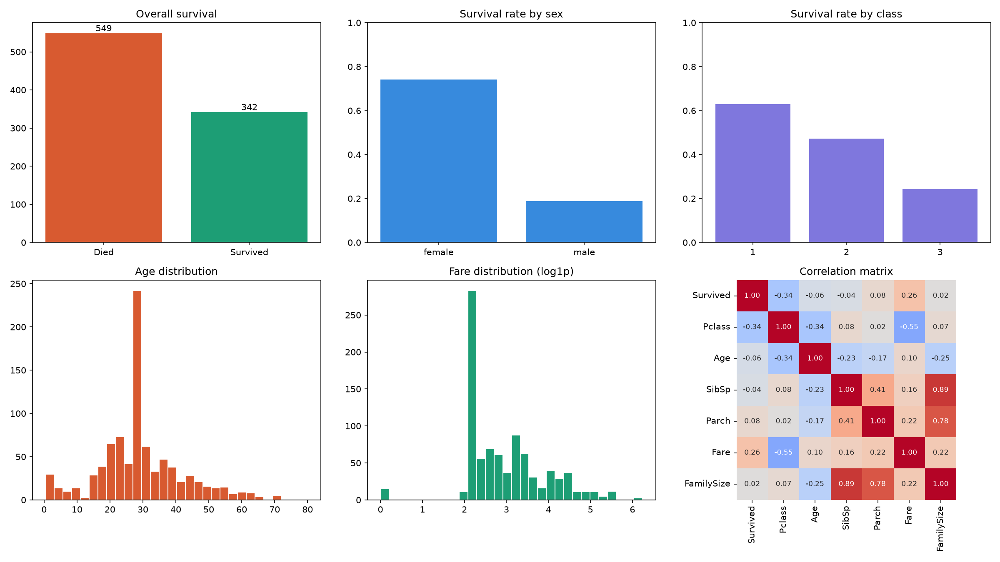

# Titanic EDA — full portfolio project
 
Day 13 of a 52-week data science to ML/AI roadmap. This project answers one
question: **what determined who survived the Titanic disaster, and can it be
shown consistently across pandas, statistical tests, and raw SQL?**
 
## Dataset
 
891 passengers, 15 columns after cleaning and feature
engineering (FamilySize, IsAlone, AgeGroup, Title added; Age imputed with
median, Cabin dropped, Embarked imputed with mode).
 
## Key findings
 
- survivors paid $48.40 avg fare vs $22.12 for non-survivors (t=6.84, p=2.70e-11) - statistically significant.
- Female survival rate 74.2% vs male 18.9% (chi2=260.7, p=1.20e-58) — statistically significant.
- Survival rate by class: 1st 63.0%, 2nd 47.3%, 3rd 24.2% (chi2=102.9, p=4.55e-23) — statistically significant.
- Strongest correlate of Survived is Pclass (r=-0.34) — correlation, not causation: Pclass is a proxy for cabin location and lifeboat access, not a direct cause.
 
## Dashboard
 

 
Six panels: overall survival, survival by sex, survival by class, age
distribution, log-scaled fare distribution, and the full correlation matrix.
 
## SQL cross-check
 
The same survival patterns are reproduced with raw SQL (GROUP BY, CASE WHEN
fare-tier bucketing, and a RANK() window function for top fares per class) —
see `day13_eda_portfolio.py` for the queries and their output.
 
## What's next
 
With more time: engineer a Title-based social class proxy, test interaction
effects between Sex and Pclass more formally, and move this analysis into a
baseline classification model.
