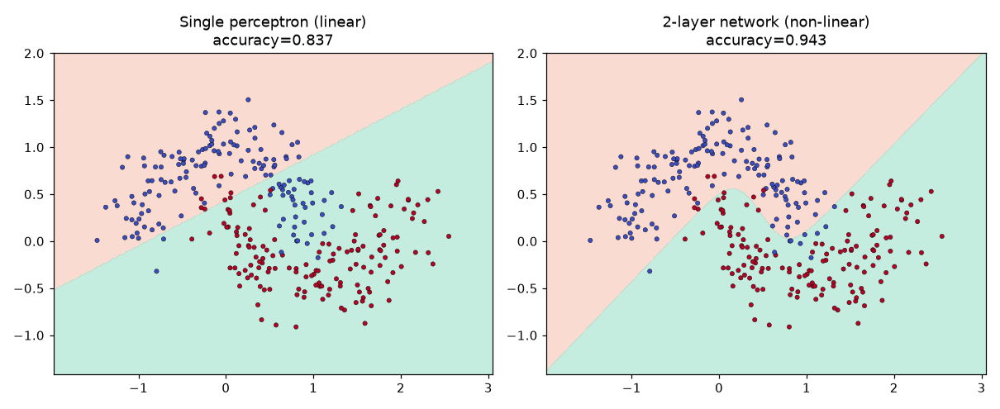
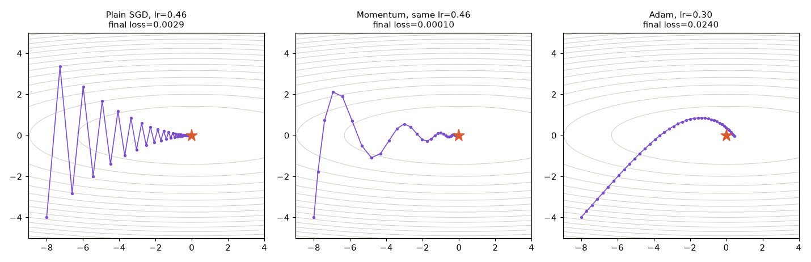
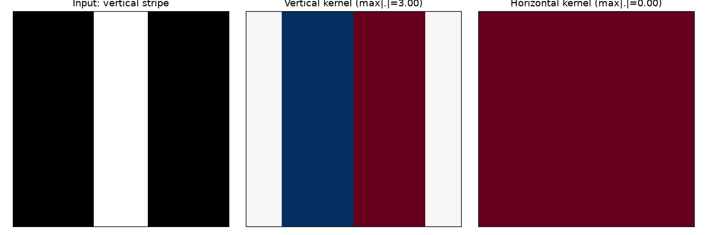
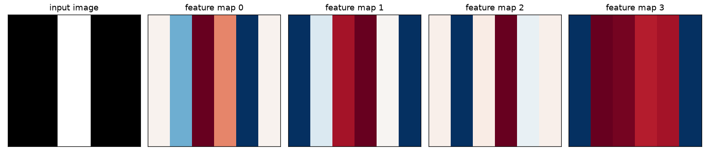

# Python Foundations — 52-week Data Science → ML/AI roadmap

A daily-practice log following a 52-week (365-day) roadmap from Python fundamentals through classical ML, deep learning, and into applied AI. Each day is a self-contained script; later days add a paired study guide (concept walkthrough + line-by-line syntax breakdown, both PDF).

**Currently on Day 49** of 365 (Day 48 — transfer learning — is still pending; Day 49 was built ahead of it by request). Full syllabus: [`full_syllabus_days_1_365.md`](full_syllabus_days_1_365.md).

## How this repo is organized

- `dayN_topic.py` — the script for day N, runnable on its own.
- `study-guides/` — for days built with the paired-PDF workflow, a concept/study guide and a syntax walkthrough per day.
- `pfdsNN.py` — short standalone practice/fundamentals drills, numbered independently of the daily roadmap.
- Loose `.png` files are the plots each script produces when run.

## Progress so far

| Weeks | Topics |
|---|---|
| 1–5 (Days 1–19) | Python fundamentals, NumPy/pandas/matplotlib, SQL, classical ML (trees, forests, cross-validation, ROC/AUC), first portfolio model |
| 6–7 (Days 21–33) | Feature engineering pipelines, gradient boosting, imbalanced classes, XGBoost, ensembles, SHAP interpretability, partial dependence, hyperparameter search (random + Bayesian/Optuna), model persistence |
| 8+ (Days 36–46) | Neural networks from scratch — forward/backprop, loss functions and optimizers, regularization, weight init and batch norm, convolutional layers, deep CNN stacking, mini-batch gradient descent, learning-rate schedules (step decay, cosine annealing) |
| 8+ (Days 47, 49) | Classic CNN architectures recreated from scratch — LeNet-5 (tanh, average pooling, 3 FC layers) and an AlexNet-style network (ReLU, 3 conv blocks, dropout, mini-batches), each honestly benchmarked against this series' own baseline conv net |

Days 36 onward build a small neural-network library from scratch in NumPy (no framework), extending it week over week — the same `net.forward()` / `net.backward()` core from Day 36 is still what every later script trains against.

## Recent visuals (Days 36–42)

| | |
|---|---|
|  Decision boundaries on toy datasets — Day 36 |  Optimizer trajectories compared — Day 37 |
|  Batch-norm activation statistics — Day 40 |  Edge-detection kernels — Day 41 |
|  CNN feature maps — Day 41 |  Accuracy vs. depth for stacked CNN layers — Day 42 |

Study guides (concept walkthrough + syntax breakdown PDFs) for the most recent days live in [`study-guides/`](study-guides).

## Featured project: Titanic EDA (Day 13)

Answers one question: what determined who survived the Titanic disaster, and does it hold up across pandas, statistical tests, and raw SQL?

**Dataset:** 891 passengers, 15 columns after cleaning and feature engineering (`FamilySize`, `IsAlone`, `AgeGroup`, `Title` added; age imputed with median, cabin dropped, embarked imputed with mode).

**Key findings:**
- Survivors paid $48.40 avg fare vs. $22.12 for non-survivors (t = 6.84, p = 2.70e-11) — statistically significant.
- Female survival rate 74.2% vs. male 18.9% (χ² = 260.7, p = 1.20e-58) — statistically significant.
- Survival rate by class: 1st 63.0%, 2nd 47.3%, 3rd 24.2% (χ² = 102.9, p = 4.55e-23) — statistically significant.
- Strongest correlate of `Survived` is `Pclass` (r = -0.34) — correlation, not causation: class is a proxy for cabin location and lifeboat access, not a direct cause.

Six panels: overall survival, survival by sex, survival by class, age distribution, log-scaled fare distribution, and the full correlation matrix.

**SQL cross-check:** the same survival patterns are reproduced with raw SQL (`GROUP BY`, `CASE WHEN` fare-tier bucketing, and a `RANK()` window function for top fares per class) — see `day13_eda_portfolio.py`.

## What's next

Continuing the roadmap day by day toward Week 53 (deep learning frameworks, deployment, and applied AI projects) — see the full syllabus for the complete week-by-week breakdown.