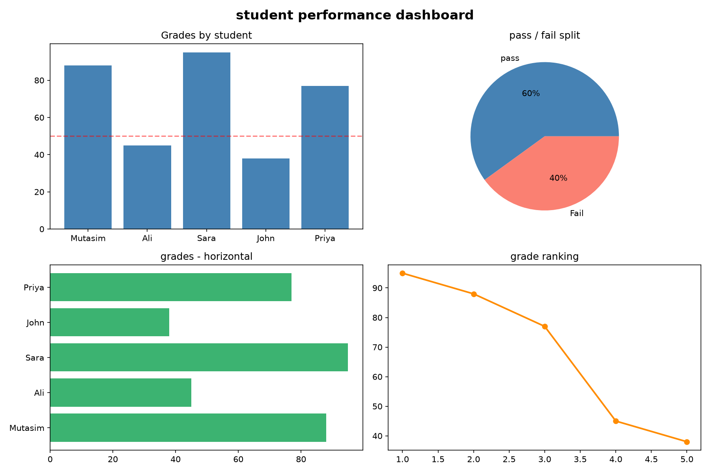
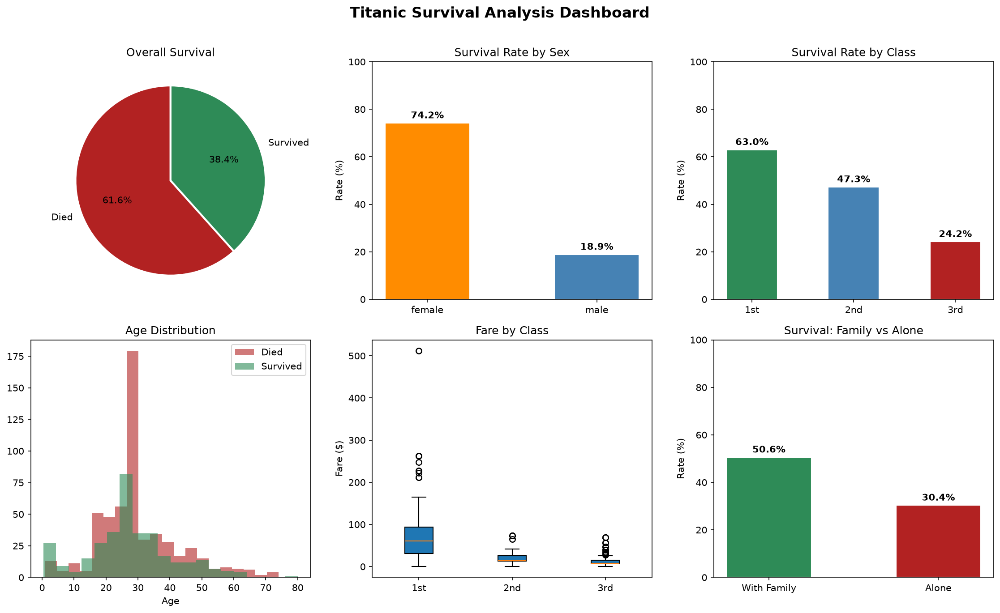

# Week 2: NumPy, Pandas, Statistics & SQL (Days 6–14)

From plain NumPy into the real data-science toolchain: Pandas, descriptive statistics, SQL, and a first full portfolio project — the Titanic dataset, which recurs throughout this entire roadmap.

## Day 6 — Pandas DataFrames, the core data science tool
[`day6_pandas.py`](day6_pandas.py) — Series, DataFrames, and the `students.csv` round-trip (write then read back).

## Day 7 — Matplotlib fundamentals
[`day7_matplotlib.py`](day7_matplotlib.py) — line/bar/histogram/scatter plots and a first multi-panel dashboard.

## Day 8 — First contact with a real dataset: Titanic
[`day8_titanic.py`](day8_titanic.py) — load, inspect, and clean `titanic.csv`: the "first 5 things every data scientist does with a new dataset."

## Day 9 — Titanic EDA: visualizing survival patterns
[`day9_titanic_viz.py`](day9_titanic_viz.py) — six charts breaking down survival by class, sex, age, and fare.

## Day 10 — Statistics fundamentals
[`Day10_statistic_titanic.py`](Day10_statistic_titanic.py) — manual descriptive statistics (mean, median, mode, variance, std, IQR, outliers), distributions, and correlation, computed on Titanic.
Study guide: [`day10_full_walkthrough.pdf`](day10_full_walkthrough.pdf)

## Day 11 — SQL basics
[`day11_sql_basics.py`](day11_sql_basics.py) — loads Titanic into a real SQLite database (`titanic.db`) and covers `SELECT`, `WHERE`, `GROUP BY`, `HAVING`, `JOIN`.

## Day 12 — SQL intermediate
[`day12_sql_intermediate.py`](day12_sql_intermediate.py) — subqueries, `CASE`, CTEs, window functions, `UNION`, reusing Day 11's database.
Study guide: [`day12_sql_intermediate_lesson.pdf`](day12_sql_intermediate_lesson.pdf)

## Day 13 — Full EDA portfolio project ⭐
[`day13_eda_portfolio.py`](day13_eda_portfolio.py) — this roadmap's featured early project: what determined who survived the Titanic disaster, cross-checked across pandas, statistical tests, and raw SQL. See the [full write-up in the main README](../README.md#featured-project-titanic-eda-day-13).
Study guide: [`day13_eda_portfolio_lesson.pdf`](day13_eda_portfolio_lesson.pdf)

## Day 14 — Week 2 review
Study guide: [`day14_review_lesson.pdf`](day14_review_lesson.pdf)

## Combined study guides
- [`day6_10_numpy_pandas_statistics_study_guide.pdf`](day6_10_numpy_pandas_statistics_study_guide.pdf)
- [`day11_14_sql_eda_study_guide.pdf`](day11_14_sql_eda_study_guide.pdf)

## Shared data files
`titanic.csv`, `titanic.db`, and `students.csv` live here (and are copied into Weeks 3–5 wherever their scripts need them) — every script also auto-downloads `titanic.csv` from its public source if it's missing locally.

---
[← Back to main README](../README.md)
