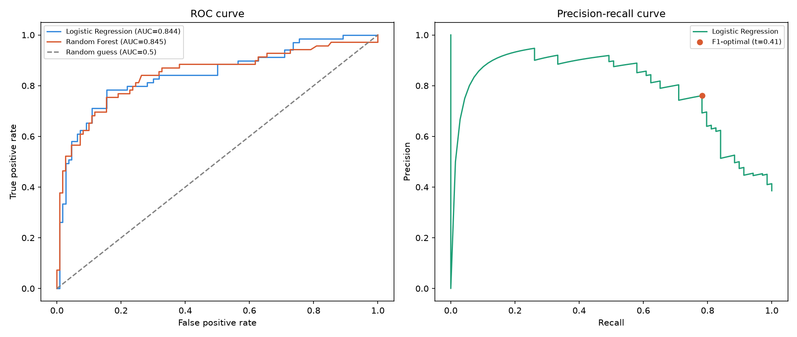
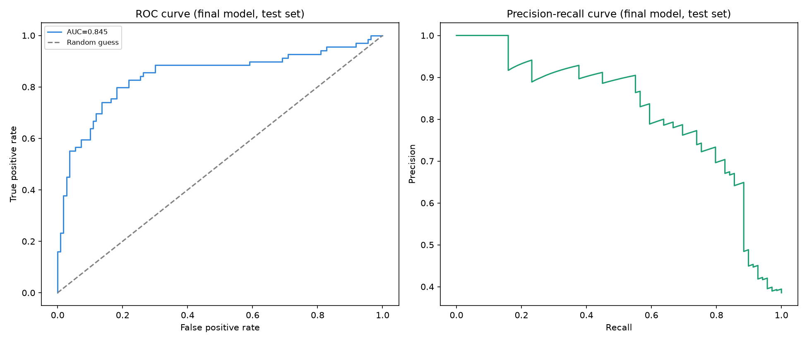

# Week 3: Intro to Machine Learning (Days 15–20)

The first real machine learning models: logistic regression, trees, forests, proper validation, and a full classification portfolio project.

## Day 15 — Intro to machine learning
[`day15_intro_ml.py`](day15_intro_ml.py) — train/test split, a logistic regression baseline, and first evaluation metrics.
Study guide: [`day15_intro_ml_lesson.pdf`](day15_intro_ml_lesson.pdf)

## Day 16 — Decision trees and random forests
[`day16_trees_forests.py`](day16_trees_forests.py) — overfitting, ensembles, and feature importance.
Study guide: [`day16_trees_forests_lesson.pdf`](day16_trees_forests_lesson.pdf)

## Day 17 — Cross-validation and hyperparameter tuning
[`day17_cross_validation.py`](day17_cross_validation.py) — `GridSearchCV` and fold-to-fold variance.
Study guides: [`day17_cross_validation_lesson.pdf`](day17_cross_validation_lesson.pdf), [`day17_cross_validation_full_lesson.pdf`](day17_cross_validation_full_lesson.pdf)

## Day 18 — ROC curves, AUC, and decision thresholds
[`day18_roc_auc_thresholds.py`](day18_roc_auc_thresholds.py) — looking beyond the default 0.5 cutoff.
Study guide: [`day18_roc_auc_thresholds_full_lesson.pdf`](day18_roc_auc_thresholds_full_lesson.pdf)

## Day 19 — Full classification portfolio project
[`day19_portfolio_project.py`](day19_portfolio_project.py) — model selection, tuning, thresholding, and a saved deployable model (`day19_final_model.joblib`).
Study guide: [`day19_portfolio_project_full_lesson.pdf`](day19_portfolio_project_full_lesson.pdf)

## Day 20 — Week 3 review
Study guide: [`day20_week3_review_complete_study_guide.pdf`](day20_week3_review_complete_study_guide.pdf)

## Shared data files
`titanic.csv` lives here too (copied from [Week 2](../week-02-numpy-pandas-statistics-sql)) so every script runs standalone.

---
[← Back to main README](../README.md)
