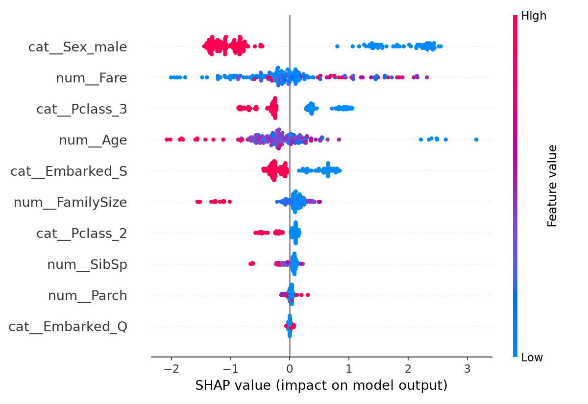
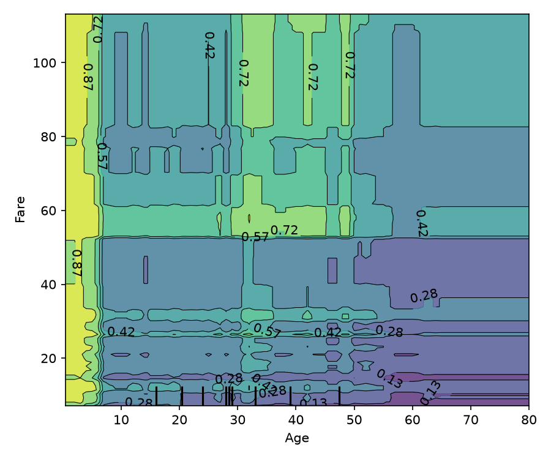

# Week 5: Interpretability, Tuning & Deployment Basics (Days 28–35)

Opening up the "black box" with SHAP, smarter hyperparameter search, saving a model for reuse, and finally serving it live behind an API.

## Day 28 — Model interpretability with SHAP
[`day28_shap_interpretability.py`](day28_shap_interpretability.py) — what actually drives a model's predictions.
Study guide: [`day28_shap_interpretability_complete_guide.pdf`](day28_shap_interpretability_complete_guide.pdf)

## Day 29 — Visual SHAP
[`day29_visual_shap.py`](day29_visual_shap.py) — bar, beeswarm, dependence, and waterfall plots.
Study guide: [`day29_visual_shap_complete_guide.pdf`](day29_visual_shap_complete_guide.pdf)

## Day 30 — Partial dependence and ICE curves
[`day30_partial_dependence_ice.py`](day30_partial_dependence_ice.py) — average vs. per-row simulated feature effects.
Study guide: [`day30_partial_dependence_ice_complete_guide.pdf`](day30_partial_dependence_ice_complete_guide.pdf)

## Day 31 — RandomizedSearchCV
[`day31_randomized_search.py`](day31_randomized_search.py) — a smarter, same-budget alternative to grid search.
Study guide: [`day31_randomized_search_complete_guide.pdf`](day31_randomized_search_complete_guide.pdf)

## Day 32 — Bayesian optimization with Optuna
[`day32_optuna_bayesian_optimization.py`](day32_optuna_bayesian_optimization.py) — a three-way search comparison against grid and random search.
Study guide: [`day32_optuna_bayesian_optimization_complete_guide.pdf`](day32_optuna_bayesian_optimization_complete_guide.pdf)

## Day 33 — Model persistence with joblib
[`day33_model_persistence.py`](day33_model_persistence.py) — saving a fitted pipeline (`titanic_pipeline.joblib` + metadata) so it never needs retraining to be reused.
Study guide: [`day33_model_persistence_complete_guide.pdf`](day33_model_persistence_complete_guide.pdf)

## Day 34 — Deploying the model behind a minimal FastAPI endpoint
[`day34_fastapi_deployment.py`](day34_fastapi_deployment.py) — loads Day 33's saved pipeline once at startup and serves predictions over a Pydantic-validated `/predict` endpoint.
Study guide: [`day34_fastapi_deployment_complete_guide.pdf`](day34_fastapi_deployment_complete_guide.pdf)

## Day 35 — Week 5 review
Study guide: [`day35_week5_review_complete_guide.pdf`](day35_week5_review_complete_guide.pdf)

## Shared data files
`titanic.csv` lives here too (copied from [Week 2](../week-02-numpy-pandas-statistics-sql)) so every script runs standalone.

---
[← Back to main README](../README.md)
