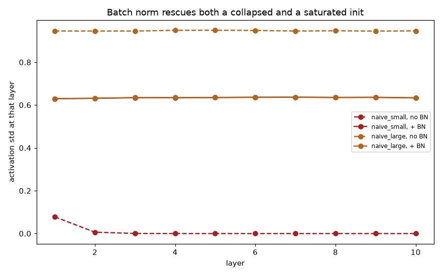

# Week 6: Neural Networks from Scratch — Beginner Edition (Days 36–41)

Where this roadmap stops calling `.fit()` on someone else's model and starts building one: a small neural-network library written entirely in NumPy, extended week over week. The same `net.forward()` / `net.backward()` core built on Day 36 is still what every later script in this series trains against, all the way through Day 49.

## Day 36 — Neural network fundamentals
[`day36_neural_network_fundamentals.py`](day36_neural_network_fundamentals.py) — perceptrons, activation functions, and the first `forward`/`backward` pass, from scratch.
Study guide: [`day36_neural_network_fundamentals_complete_guide.pdf`](day36_neural_network_fundamentals_complete_guide.pdf) · Syntax walkthrough: [`day36_syntax_line_by_line.pdf`](day36_syntax_line_by_line.pdf) ([source](day36_syntax_line_by_line.md))

## Day 37 — Loss functions and optimizers
[`day37_loss_functions_optimizers.py`](day37_loss_functions_optimizers.py) — MSE/BCE loss, and SGD vs. Momentum vs. Adam.
Study guide: [`day37_loss_functions_optimizers_complete_guide.pdf`](day37_loss_functions_optimizers_complete_guide.pdf) · Syntax walkthrough: [`day37_syntax_line_by_line.pdf`](day37_syntax_line_by_line.pdf)

## Day 38 — Regularization
[`day38_regularization.py`](day38_regularization.py) — L2 weight decay, dropout, and early stopping.
Study guide: [`day38_regularization_complete_guide.pdf`](day38_regularization_complete_guide.pdf) · Syntax walkthrough: [`day38_syntax_line_by_line.pdf`](day38_syntax_line_by_line.pdf) · [Run output](day38_run_output.txt)

## Day 39 — Softmax, cross-entropy, and mini-batch training
[`day39_softmax_minibatch.py`](day39_softmax_minibatch.py) — multi-class classification and the first mini-batch training loop.
Study guide: [`day39_softmax_minibatch_complete_guide.pdf`](day39_softmax_minibatch_complete_guide.pdf) · Syntax walkthrough: [`day39_syntax_line_by_line.pdf`](day39_syntax_line_by_line.pdf) · [Run output](day39_run_output.txt)

## Day 40 — Weight initialization and batch normalization
[`day40_weight_init_batchnorm.py`](day40_weight_init_batchnorm.py) — why initialization scale matters, and how batch norm stabilizes activations.
Study guide: [`day40_weight_init_batchnorm_complete_guide.pdf`](day40_weight_init_batchnorm_complete_guide.pdf) · Syntax walkthrough: [`day40_syntax_line_by_line.pdf`](day40_syntax_line_by_line.pdf) · [Run output](day40_run_output.txt)

## Day 41 — Convolutional layers
[`day41_convolutional_layers.py`](day41_convolutional_layers.py) — `conv2d`, max pooling, and a first ConvNet trained on a stripe dataset.
Study guide: [`day41_convolutional_layers_complete_guide.pdf`](day41_convolutional_layers_complete_guide.pdf) · Syntax walkthrough: [`day41_syntax_line_by_line.pdf`](day41_syntax_line_by_line.pdf) · [Run output](day41_run_output.txt)

## Diagrams
This folder also holds every system diagram and supporting plot the study guides above embed (activation flows, loss/optimizer flow, batch-norm and pooling mechanics, and more) — named descriptively (e.g. `diagram_network_architecture.png`, `maxpool_diagram.png`) rather than day-numbered, since several illustrate ideas spanning more than one day.

---
[← Back to main README](../README.md)
