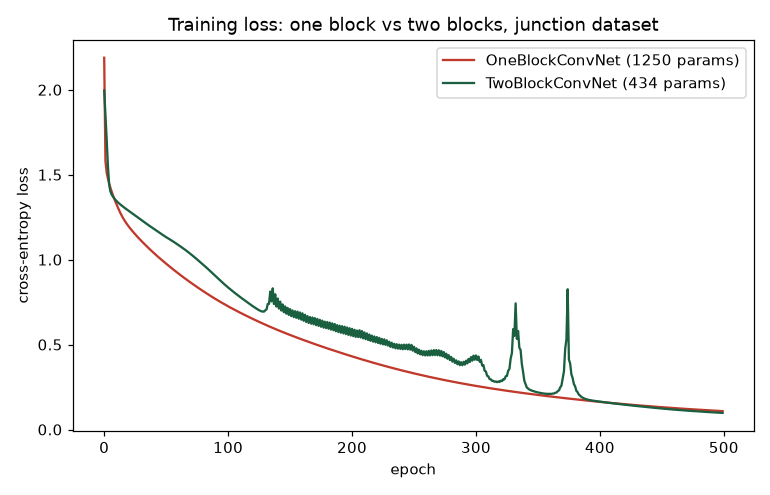
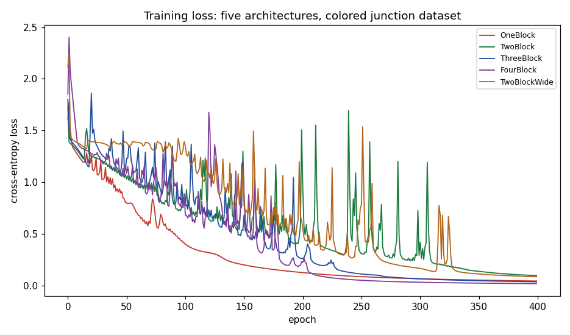
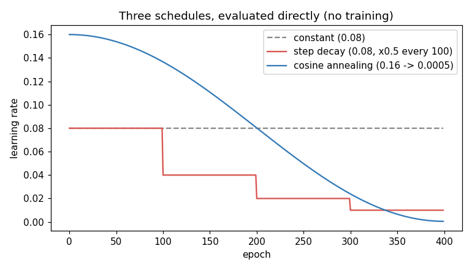
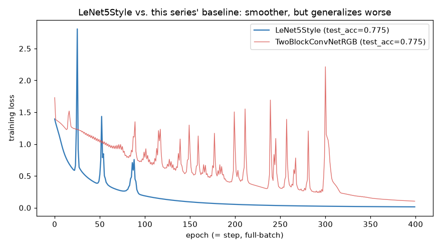
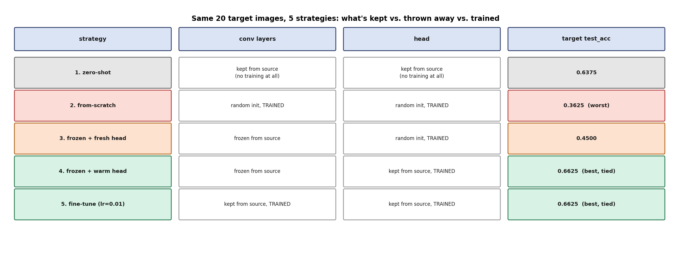

# Week 7: CNNs I & II (Days 42–48)

Stacking convolutional blocks deeper, moving from synthetic to real RGB images, real training mechanics (mini-batches, learning-rate schedules), and the first two "meet a real historical idea" days: LeNet-5 and transfer learning.

## Day 42 — Deep CNNs: stacking conv+pool blocks
[`day42_deep_cnn_stacking.py`](day42_deep_cnn_stacking.py) — multi-channel convolution, receptive field growth, and parameter efficiency as networks get deeper.
Study guide: [`day42_deep_cnn_stacking_complete_guide.pdf`](day42_deep_cnn_stacking_complete_guide.pdf) · Syntax walkthrough: [`day42_syntax_line_by_line.pdf`](day42_syntax_line_by_line.pdf) · [Run output](day42_run_output.txt)

## Day 43 — Real RGB images + a three-block CNN
[`day43_real_images_three_blocks.py`](day43_real_images_three_blocks.py) — moves off synthetic data onto real photos (scikit-learn's bundled sample images), resizing/normalizing/augmenting them for a CNN.
Study guide: [`day43_real_images_three_blocks_complete_guide.pdf`](day43_real_images_three_blocks_complete_guide.pdf) · Syntax walkthrough: [`day43_syntax_line_by_line.pdf`](day43_syntax_line_by_line.pdf) · [Run output](day43_run_output.txt)

## Day 44 — "Same" padding: does depth or width actually win?
[`day44_same_padding_and_depth.py`](day44_same_padding_and_depth.py) — same-padding convolutions, and a real depth-vs-width training comparison.
Study guide: [`day44_same_padding_and_depth_complete_guide.pdf`](day44_same_padding_and_depth_complete_guide.pdf) · Syntax walkthrough: [`day44_syntax_line_by_line.pdf`](day44_syntax_line_by_line.pdf) · [Run output](day44_run_output.txt)

## Day 45 — Mini-batch gradient descent from scratch
[`day45_mini_batch_gd.py`](day45_mini_batch_gd.py) — shuffling, batch loops, and a real noise-vs-full-batch convergence comparison.
Study guide: [`day45_mini_batch_gd_complete_guide.pdf`](day45_mini_batch_gd_complete_guide.pdf) · Syntax walkthrough: [`day45_syntax_line_by_line.pdf`](day45_syntax_line_by_line.pdf)

## Day 46 — Learning rate schedules
[`day46_learning_rate_schedules.py`](day46_learning_rate_schedules.py) — step decay and cosine annealing, revisiting Day 44's wide network with a real schedule instead of a fixed learning rate.
Study guide: [`day46_learning_rate_schedules_complete_guide.pdf`](day46_learning_rate_schedules_complete_guide.pdf) · Syntax walkthrough: [`day46_syntax_line_by_line.pdf`](day46_syntax_line_by_line.pdf) · [Run output](day46_run_output.txt)

## Day 47 — Classic CNN architectures I: LeNet-5, by hand
[`day47_lenet5_style_cnn.py`](day47_lenet5_style_cnn.py) — recreates LeCun et al.'s 1998 LeNet-5 (tanh, average pooling, three FC layers) and honestly benchmarks it against this series' own baseline. Result: 21.8x more parameters, identical test accuracy.
Study guide: [`day47_lenet5_style_cnn_complete_guide.pdf`](day47_lenet5_style_cnn_complete_guide.pdf) · Syntax walkthrough: [`day47_syntax_line_by_line.pdf`](day47_syntax_line_by_line.pdf) · [Run output](day47_run_output.txt)

## Day 48 — Transfer learning: freezing, fine-tuning, and why the head matters
[`day48_transfer_learning.py`](day48_transfer_learning.py) — five honestly-run transfer strategies on a visually-shifted, data-starved target domain. Real finding: training from scratch on 20 images is worse than doing nothing at all.
Study guide: [`day48_transfer_learning_complete_guide.pdf`](day48_transfer_learning_complete_guide.pdf) · Syntax walkthrough: [`day48_syntax_line_by_line.pdf`](day48_syntax_line_by_line.pdf)

## Diagrams and real-image assets
Also here: every architecture/pipeline diagram the study guides above embed, plus the real-photo pipeline artifacts Day 43 produces (`china_original_unmodified.jpg`, `flower_original_unmodified.jpg`, `real_augmentation.png`, etc.).

---
[← Back to main README](../README.md)
