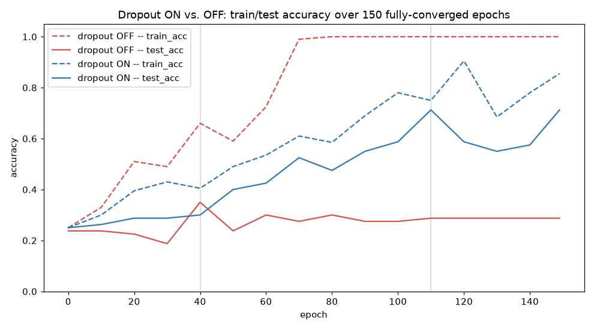

# Week 8: Classic CNN Architectures + Regularization (Days 49–55)

Continuing the "recreate a real historical architecture, honestly" thread from Days 47–48. Currently in progress — Days 49–50 are built; Days 51–55 (L1/L2 on CNNs, VGG-style stacked convs, residual connections, batch norm in CNNs, and data-loading pipelines) are still ahead. See [`full_syllabus_days_1_365.md`](../full_syllabus_days_1_365.md) for what's planned.

## Day 49 — AlexNet-style deeper CNN
[`day49_alexnet_style_cnn.py`](day49_alexnet_style_cnn.py) — rebuilds AlexNet's (2012) defining ideas at this series' scale: ReLU throughout, a third stacked conv+pool block, two big dropout-regularized FC layers, on larger 40x40 images, trained with real mini-batches for the first time since Day 45's mechanism. New from-scratch code: a standalone inverted-dropout layer, verified by both a pooled statistical check and a full gradient check.

Honest result: on a fixed 40-epoch budget, this series' own much smaller 2-block baseline beats AlexNetStyle outright (test_acc=0.613 vs. 0.363) — two stacked dropout layers cut how much signal reaches the FC weights per step, so the deeper, dropout-heavy network needs more training steps to catch up. A follow-up ablation confirms dropout does narrow the train/test gap as intended, just not within this epoch budget.

Study guide: [`day49_alexnet_style_cnn_complete_guide.pdf`](day49_alexnet_style_cnn_complete_guide.pdf) · Syntax walkthrough: [`day49_syntax_line_by_line.pdf`](day49_syntax_line_by_line.pdf) · [Run output](day49_run_output.txt)

## Day 50 — Dropout revisited: a fully-converged regularized-vs-unregularized comparison
[`day50_dropout_regularization_comparison.py`](day50_dropout_regularization_comparison.py) — Day 49's dropout ablation was honestly inconclusive because 40 epochs wasn't enough training for either configuration. Today reuses the same dropout layer and AlexNetStyleConvNet verbatim, but trains for 150 epochs at lr=0.15 — enough for both configurations to actually converge — and tracks train/test accuracy every 10 epochs during training (new today), not just once at the end.

The textbook result, for real: dropout OFF reaches train_acc=1.0000 (perfect memorization) but test_acc=0.2875 (barely above a 4-class coin flip), and its test accuracy peaks at epoch 40 then never improves again. Dropout ON never fully memorizes the training set (train_acc caps at 0.8550) but reaches test_acc=0.7125 — 2.5x better — peaking at epoch 110 without collapsing away from it.

[Run output](day50_run_output.txt)

---
[← Back to main README](../README.md)
