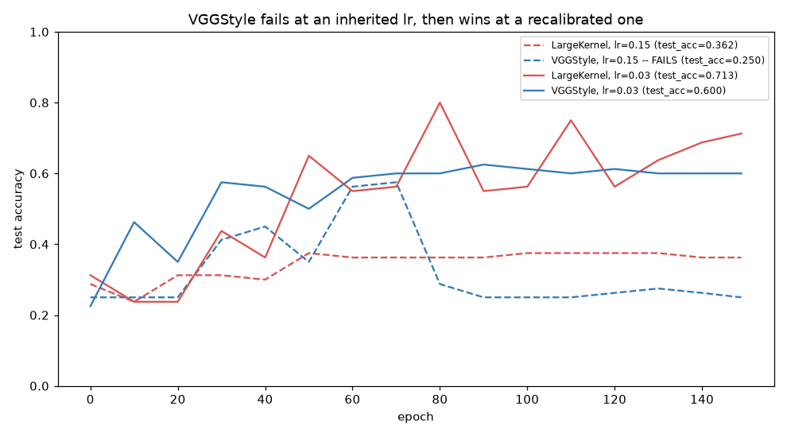
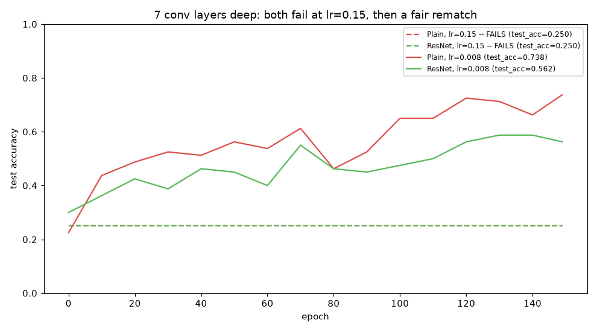
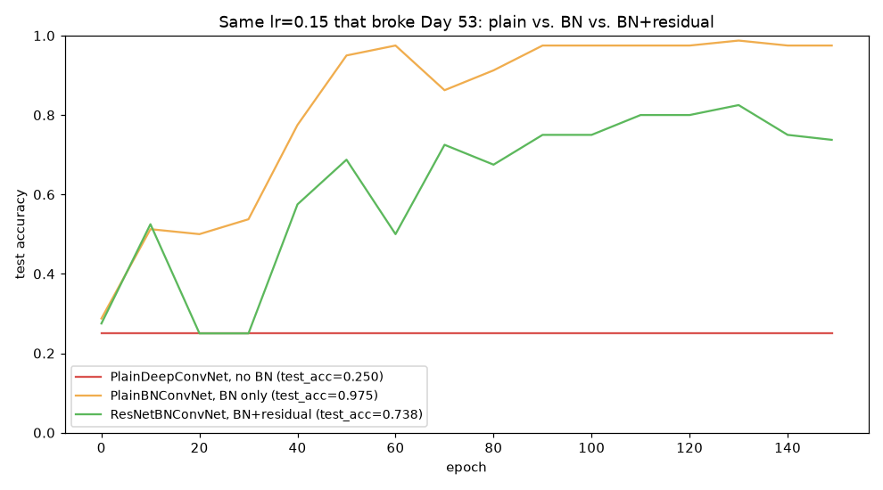

# Week 8: Classic CNN Architectures + Regularization (Days 49–55)

Continuing the "recreate a real historical architecture, honestly" thread from Days 47–48. Currently in progress — Days 49–54 are built; Day 55 (real image data pipeline efficiency) is still ahead. See [`full_syllabus_days_1_365.md`](../full_syllabus_days_1_365.md) for what's planned.

## Day 49 — AlexNet-style deeper CNN
[`day49_alexnet_style_cnn.py`](day49_alexnet_style_cnn.py) — rebuilds AlexNet's (2012) defining ideas at this series' scale: ReLU throughout, a third stacked conv+pool block, two big dropout-regularized FC layers, on larger 40x40 images, trained with real mini-batches for the first time since Day 45's mechanism. New from-scratch code: a standalone inverted-dropout layer, verified by both a pooled statistical check and a full gradient check.

Honest result: on a fixed 40-epoch budget, this series' own much smaller 2-block baseline beats AlexNetStyle outright (test_acc=0.613 vs. 0.363) — two stacked dropout layers cut how much signal reaches the FC weights per step, so the deeper, dropout-heavy network needs more training steps to catch up. A follow-up ablation confirms dropout does narrow the train/test gap as intended, just not within this epoch budget.

Study guide: [`day49_alexnet_style_cnn_complete_guide.pdf`](day49_alexnet_style_cnn_complete_guide.pdf) · Syntax walkthrough: [`day49_syntax_line_by_line.pdf`](day49_syntax_line_by_line.pdf) · [Run output](day49_run_output.txt)

## Day 50 — Dropout revisited: a fully-converged regularized-vs-unregularized comparison
[`day50_dropout_regularization_comparison.py`](day50_dropout_regularization_comparison.py) — Day 49's dropout ablation was honestly inconclusive because 40 epochs wasn't enough training for either configuration. Today reuses the same dropout layer and AlexNetStyleConvNet verbatim, but trains for 150 epochs at lr=0.15 — enough for both configurations to actually converge — and tracks train/test accuracy every 10 epochs during training (new today), not just once at the end.

The textbook result, for real: dropout OFF reaches train_acc=1.0000 (perfect memorization) but test_acc=0.2875 (barely above a 4-class coin flip), and its test accuracy peaks at epoch 40 then never improves again. Dropout ON never fully memorizes the training set (train_acc caps at 0.8550) but reaches test_acc=0.7125 — 2.5x better — peaking at epoch 110 without collapsing away from it.

Study guide: [`day50_dropout_regularization_comparison_complete_guide.pdf`](day50_dropout_regularization_comparison_complete_guide.pdf) · Syntax walkthrough: [`day50_syntax_line_by_line.pdf`](day50_syntax_line_by_line.pdf) · [Run output](day50_run_output.txt)

## Day 51 — L1/L2 weight regularization revisited on CNNs: a real over/underfitting sweep
[`day51_l1_l2_regularization_cnn.py`](day51_l1_l2_regularization_cnn.py) — Day 38 introduced L2 weight decay on a toy sigmoid network; today adds L1 (new today) and sweeps both across Day 50's fully-converged training budget on the real AlexNetStyleConvNet, dropout held OFF throughout to isolate weight regularization's own effect.

Honest, non-symmetric result: a small L2 penalty (lam=5e-5) lifts test_acc from 0.2875 to 0.3750 while train_acc stays at a perfect 1.0000 — unlike dropout, it doesn't stop memorization, it just makes the memorized solution generalize better. L1 never improves test accuracy anywhere in its useful lambda range — it's either invisible or purely costly — but does deliver its textbook sparsity property: 96.3% of weights pushed near zero at lam=5e-3, vs. ~5% for L2, measured directly on the trained network. Both families collapse to chance-level performance (genuine underfitting) at a large enough lambda.

Study guide: [`day51_l1_l2_regularization_cnn_complete_guide.pdf`](day51_l1_l2_regularization_cnn_complete_guide.pdf) · Syntax walkthrough: [`day51_syntax_line_by_line.pdf`](day51_syntax_line_by_line.pdf) · [Run output](day51_run_output.txt)

## Day 52 — VGG-style architecture: stacked small kernels vs. one big one
[`day52_vgg_style_stacked_convs.py`](day52_vgg_style_stacked_convs.py) — Days 49–51 all varied the FC head or training regime; today changes the conv side instead. VGG (Simonyan & Zisserman, 2014) made one specific bet: replace a single large-kernel conv with several stacked small 3x3 convs reaching the same receptive field. Two full 2-block CNNs are built and gradient-checked — LargeKernelConvNet (one 5x5 conv per block) and VGGStyleConvNet (two stacked 3x3 convs per block, same channel width C throughout) — confirmed to reach the identical 5x5 receptive field at 8,332 vs. 8,572 total parameters (2.8% savings). Starting today, every line of code in the lesson script carries its own inline comment.

Two honest, non-tidy findings. First: trained at Day 50/51's inherited lr=0.15, LargeKernelConvNet converges fine (train_acc=1.000) but VGGStyleConvNet never learns at all (train_acc=0.245, chance level) — diagnosed directly (not assumed) as severe dying ReLUs, with block 2's first conv layer 99.9% dead. VGGStyleConvNet is twice as deep in its conv stack (4 conv+ReLU layers vs. 2), and a learning rate tuned for the shallower network is far too aggressive for the deeper one — a direct preview of why Day 53 (residual connections) and Day 54 (batch norm) exist. Second: once both networks are retrained at a properly-recalibrated lr=0.03 (found by measuring dead-unit fraction across a small sweep) and both fully converge (train_acc=1.000), LargeKernelConvNet actually generalizes *better* (test_acc=0.7125) than VGGStyleConvNet (test_acc=0.600) — despite VGGStyle's real, confirmed parameter savings. VGG's advantage was demonstrated at ImageNet scale with far deeper stacks; it doesn't automatically transfer to this lesson's small scale, echoing what Day 47's LeNet-5 and Day 49's AlexNet recreations already showed.

Study guide: [`day52_vgg_style_stacked_convs_complete_guide.pdf`](day52_vgg_style_stacked_convs_complete_guide.pdf) · Syntax walkthrough: [`day52_syntax_line_by_line.pdf`](day52_syntax_line_by_line.pdf) · [Run output](day52_run_output.txt)

## Day 53 — Residual connections: what they actually fix (and don't)
[`day53_residual_connections.py`](day53_residual_connections.py) — Day 52 ended on a cliffhanger: a 4-conv-layer network failed completely at lr=0.15 from dying ReLUs. Today builds He et al.'s (2015) fix — an identity shortcut around each block, `out = ReLU(F(x) + x)` — and pushes depth further still: `PlainDeepConvNet` and `ResNetStyleConvNet` both stack 7 conv+ReLU layers (nearly double Day 52's deepest network), sharing identical parameter counts since shortcuts add zero parameters. A new diagnostic measures gradient norm by depth *at initialization* (both networks given identical starting weights): the earliest layer retains 41.5% of the deepest layer's gradient magnitude in the residual network vs. only 11.6% in the plain one — a real, measured effect. Starting today, `conv2d_forward_mc`/`backward_mc` are also rewritten from a per-output-pixel loop to a loop over kernel offsets (mathematically identical, ~4x faster), which is what kept this day's larger experiment tractable.

Two honest, non-tidy findings. First: thrown at Day 52's exact lr=0.15, **both** networks fail completely (chance-level, 100% dead ReLUs in multiple blocks) — residual connections do not automatically rescue an overly-aggressive learning rate at this depth; more gradient reaching a layer isn't the same as a smaller update step once it arrives. Second: after a short lr sweep finds lr=0.008 and both networks are retrained for the full 150 epochs, `PlainDeepConvNet` actually generalizes *better* (test_acc=0.7375) than `ResNetStyleConvNet` (test_acc=0.5625) — despite the residual network's real, measured gradient-flow advantage and identical parameter count. A shortcut connection measurably changes how gradient is distributed across depth, which is real and worth understanding on its own terms, but that's a distinct effect from learning-rate calibration, and neither guarantees the more sophisticated architecture wins on a given dataset at a given scale.

Study guide: [`day53_residual_connections_complete_guide.pdf`](day53_residual_connections_complete_guide.pdf) · Syntax walkthrough: [`day53_syntax_line_by_line.pdf`](day53_syntax_line_by_line.pdf) · [Run output](day53_run_output.txt)

## Day 54 — Batch normalization in CNNs: BN alone beats BN+residual here
[`day54_batchnorm_in_cnns.py`](day54_batchnorm_in_cnns.py) — Day 40's dense-layer batch norm extended to conv layers: normalize each *channel* using statistics pooled over the batch AND both spatial axes, with one learned gamma/beta per channel. Three networks are compared at Day 53's exact failing lr=0.15: `PlainDeepConvNet` (Day 53's control, redefined here), `PlainBNConvNet` (BN added after every conv, no residual), and `ResNetBNConvNet` (BN *and* residual shortcuts together — the real published ResNet basic block). The gradient check caught a real bug along the way: `dgamma`/`dbeta` initially came out scaled by the batch size too large, because they weren't divided by `m` the way every other parameter gradient in this codebase already is. A gradient-flow-by-depth diagnostic (all three networks given identical initial weights) shows BN changes gradient distribution far more dramatically than residual shortcuts alone did — BN-only's stem-to-deepest ratio (1.53) actually *exceeds* 1.0.

Not the tidy "combine both fixes for the best result" story. At lr=0.15, `PlainDeepConvNet` still fails completely (train_acc=0.250, unchanged from Day 53). `PlainBNConvNet` — batch norm *alone*, no residual — not only trains but reaches train_acc=1.000/test_acc=0.975, the best result any network in this two-day arc has reached. `ResNetBNConvNet` (BN and residual together) trains too, but far more unevenly and to a lower ceiling (test_acc=0.738) — its trajectory visibly oscillates rather than climbing smoothly. Adding a raw, unnormalized identity shortcut on top of a normalized branch, right before the final ReLU, changed the distribution the next layer's batch norm had to renormalize; at this lesson's small scale, that combination trained less smoothly than batch norm by itself, not more — the same scale-dependence caveat Days 47, 49, 52, and 53 already taught with their own architectures.

Study guide: [`day54_batchnorm_in_cnns_complete_guide.pdf`](day54_batchnorm_in_cnns_complete_guide.pdf) · Syntax walkthrough: [`day54_syntax_line_by_line.pdf`](day54_syntax_line_by_line.pdf) · [Run output](day54_run_output.txt)

---
[← Back to main README](../README.md)
