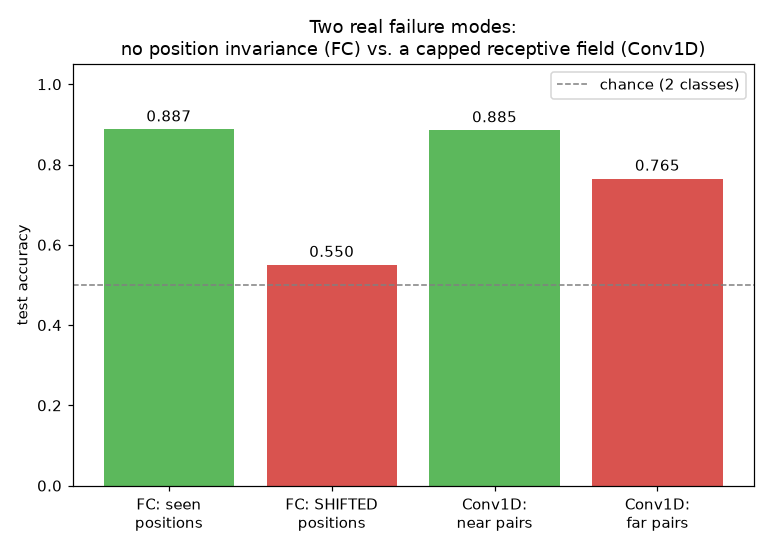

# Week 9: Sequence Data & RNNs I (Days 56–62)

The first themed week built with the new two-track structure: Days 56–61 each get **two** deliverables — the usual full-depth lesson (gradient checks, real experiments, paired study-guide PDFs) plus a short, lightweight `dayNN_exercise.py` isolating that day's one component in the simplest form possible (no PDFs — just a quick, runnable script). Day 62 combines the six exercise scripts into one final, complete, trained RNN, evaluated end-to-end. See [`full_syllabus_days_1_365.md`](../full_syllabus_days_1_365.md) for the full week's plan.

## Day 56 — What is sequential data: why feedforward and CNN nets fail on it
[`day56_sequential_data_intro.py`](day56_sequential_data_intro.py) — a synthetic but genuine "order matters" task (a length-30 sequence with a HIGH spike and a LOW spike; label = whether high comes before low) demonstrates two distinct, measured failure modes rather than asserting them. `PlainFCNet` (dense, flattened input) is trained with both spikes confined to positions 0–14, then tested on positions 15–29 — its first-layer weights are position-specific, so it has no mechanism to transfer a learned pattern to a new location. `Conv1DNet` (one 1D conv layer + global average pooling, reusing Day 53's `conv2d_forward_mc`/`backward_mc` via a reshape trick) has translation invariance via weight sharing, but only within its kernel's own receptive field.

Real results: PlainFCNet reaches train_acc=1.000 and held-out-seen-position test_acc=0.888 (it genuinely learned the rule) — but SHIFTED-position test_acc collapses to 0.550, chance level. Conv1DNet reaches 0.885 test accuracy on spike pairs within its kernel's reach ("near") vs. 0.765 on pairs farther apart ("far") — a real, repeatable gap, though not the full collapse to chance PlainFCNet showed (global average pooling leaks a faint boundary-driven positional signal even when it can't preserve true relative order). Getting an honest reading of the second result took a real correction: the first training configuration was too undertrained to trust and produced the *opposite*, wrong pattern — retraining harder reproduced the theoretically-expected result cleanly.

Study guide: [`day56_sequential_data_intro_complete_guide.pdf`](day56_sequential_data_intro_complete_guide.pdf) · Syntax walkthrough: [`day56_syntax_line_by_line.pdf`](day56_syntax_line_by_line.pdf) · [Run output](day56_run_output.txt)

Exercise: [`day56_exercise.py`](day56_exercise.py) isolates just the PlainFCNet position-generalization result in a short, standalone script ([run output](day56_exercise_run_output.txt)) — this is the baseline Day 62's final integrated model will be measured against.

---
[← Back to main README](../README.md)
