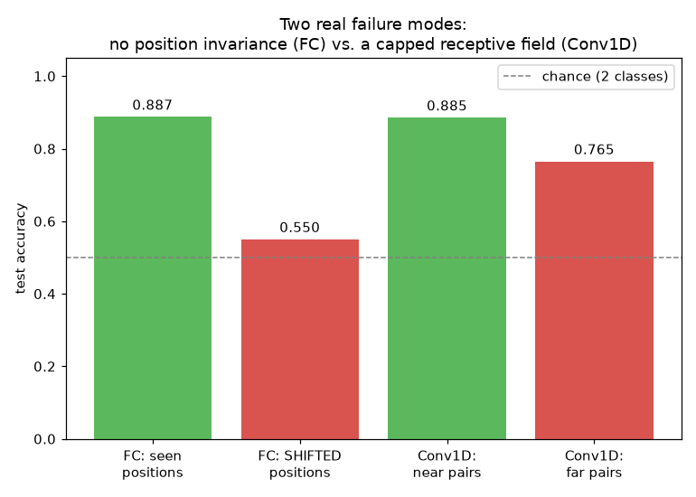
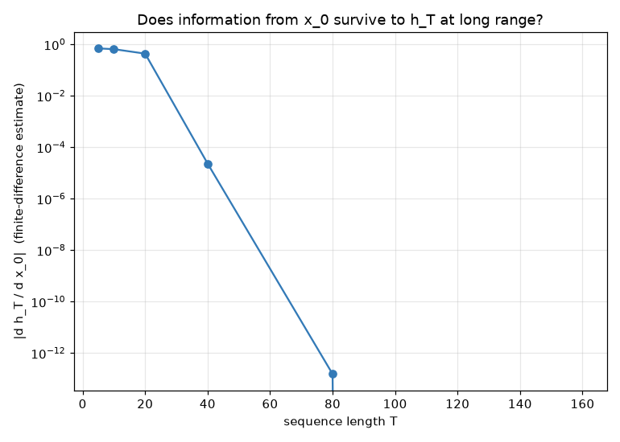
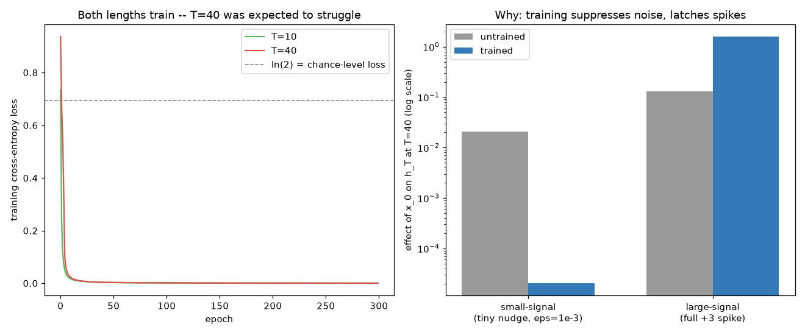
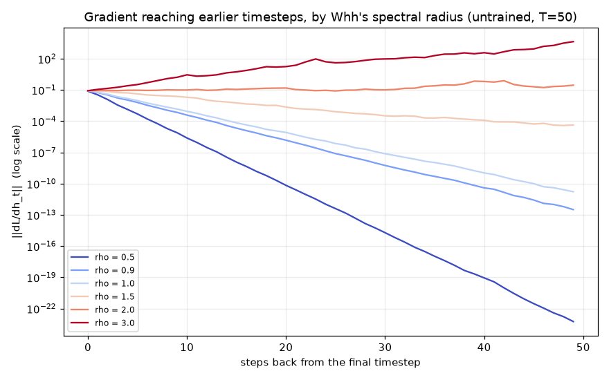
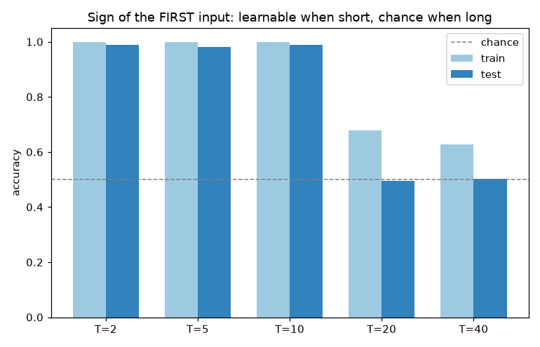
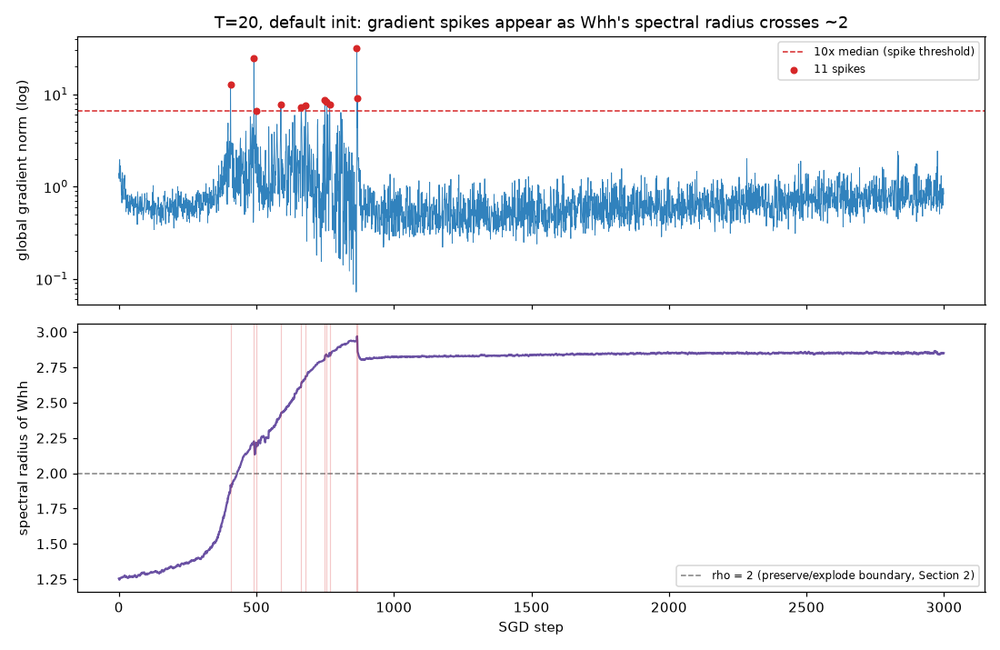
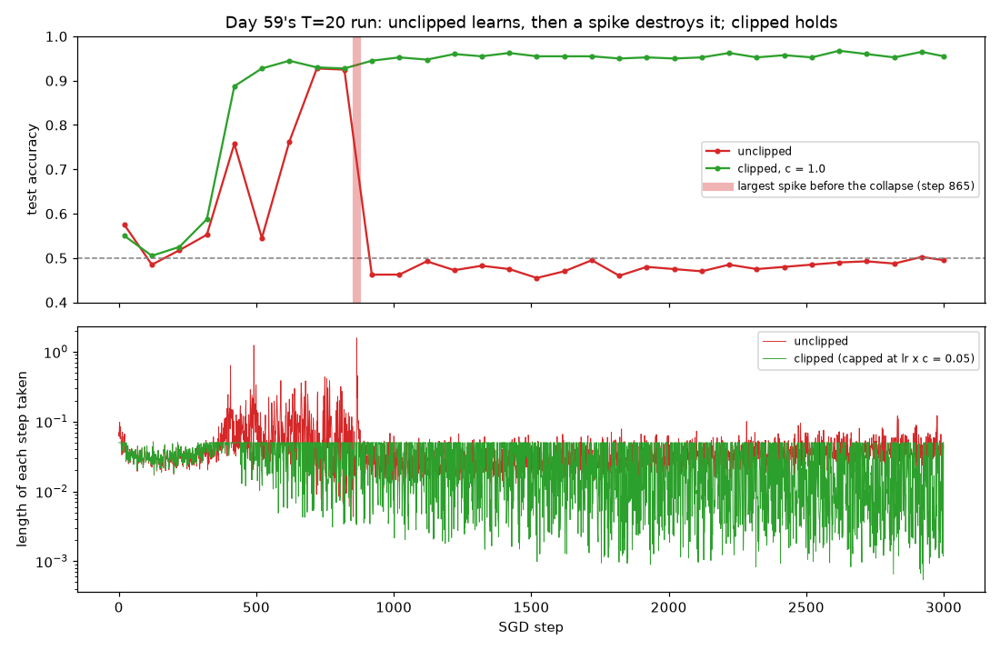
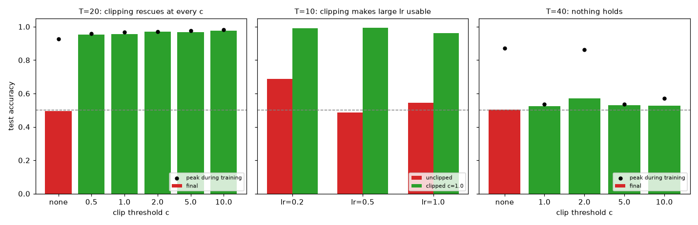

# Week 9: Sequence Data & RNNs I (Days 56–62)

The first themed week built with the new two-track structure: Days 56–61 each get **two** deliverables — the usual full-depth lesson (gradient checks, real experiments, paired study-guide PDFs) plus a short, lightweight `dayNN_exercise.py` isolating that day's one component in the simplest form possible (no PDFs — just a quick, runnable script). Day 62 combines the six exercise scripts into one final, complete, trained RNN, evaluated end-to-end. See [`full_syllabus_days_1_365.md`](../full_syllabus_days_1_365.md) for the full week's plan.

## Day 56 — What is sequential data: why feedforward and CNN nets fail on it
[`day56_sequential_data_intro.py`](day56_sequential_data_intro.py) — a synthetic but genuine "order matters" task (a length-30 sequence with a HIGH spike and a LOW spike; label = whether high comes before low) demonstrates two distinct, measured failure modes rather than asserting them. `PlainFCNet` (dense, flattened input) is trained with both spikes confined to positions 0–14, then tested on positions 15–29 — its first-layer weights are position-specific, so it has no mechanism to transfer a learned pattern to a new location. `Conv1DNet` (one 1D conv layer + global average pooling, reusing Day 53's `conv2d_forward_mc`/`backward_mc` via a reshape trick) has translation invariance via weight sharing, but only within its kernel's own receptive field.

Real results: PlainFCNet reaches train_acc=1.000 and held-out-seen-position test_acc=0.888 (it genuinely learned the rule) — but SHIFTED-position test_acc collapses to 0.550, chance level. Conv1DNet reaches 0.885 test accuracy on spike pairs within its kernel's reach ("near") vs. 0.765 on pairs farther apart ("far") — a real, repeatable gap, though not the full collapse to chance PlainFCNet showed (global average pooling leaks a faint boundary-driven positional signal even when it can't preserve true relative order). Getting an honest reading of the second result took a real correction: the first training configuration was too undertrained to trust and produced the *opposite*, wrong pattern — retraining harder reproduced the theoretically-expected result cleanly.

Study guide: [`day56_sequential_data_intro_complete_guide.pdf`](day56_sequential_data_intro_complete_guide.pdf) · Syntax walkthrough: [`day56_syntax_line_by_line.pdf`](day56_syntax_line_by_line.pdf) · [Run output](day56_run_output.txt)

Exercise: [`day56_exercise.py`](day56_exercise.py) isolates just the PlainFCNet position-generalization result in a short, standalone script ([run output](day56_exercise_run_output.txt)) — this is the baseline Day 62's final integrated model will be measured against.

## Day 57 — Vanilla RNN forward pass from scratch on a real toy sequence
[`day57_rnn_forward_pass.py`](day57_rnn_forward_pass.py) — builds the RNN recurrence `h_t = tanh(x_t @ Wxh + h_{t-1} @ Whh + bh)`, the same three parameters reused at every timestep. No backward pass yet (that's Day 58), so verification takes a different form: the looped implementation is checked against an explicit hand-unrolled computation (exact match), then the same untrained network is run forward on Day 56's task at three different sequence lengths (10, 20, 30) with zero errors — direct proof against Day 56's `PlainFCNet` `ValueError`.

The headline result is a real, dramatic measurement: does information from position 0 survive to the final hidden state at long range, the way Conv1DNet's capped receptive field structurally couldn't? A finite-difference sensitivity check finds it starts at 0.70 (T=5), is still 0.44 at T=20 — then collapses to 0.000024 by T=40 and is *exactly* 0.0 by T=160 (float64 runs out of precision to represent it). There's no hard structural cutoff like Conv1DNet's kernel size, but the connection collapses in practice anyway — a forward-pass-only preview of Day 59's real topic (vanishing/exploding gradients), visible before backpropagation is even built.

Study guide: [`day57_rnn_forward_pass_complete_guide.pdf`](day57_rnn_forward_pass_complete_guide.pdf) · Syntax walkthrough: [`day57_syntax_line_by_line.pdf`](day57_syntax_line_by_line.pdf) · [Run output](day57_run_output.txt)

Exercise: [`day57_exercise.py`](day57_exercise.py) isolates just the RNN cell (`rnn_step_forward`/`rnn_forward`) and its hand-unrolled correctness check ([run output](day57_exercise_run_output.txt)) — Day 58's exercise will backprop through exactly this function.

## Day 58 — RNN backward pass (BPTT) from scratch + gradient check
[`day58_rnn_bptt.py`](day58_rnn_bptt.py) — backpropagation through time: ordinary backprop on the unrolled network, plus one rule — the same `Wxh`, `Whh`, `bh` are used at every timestep, so their gradients are *summed* across all of them, and gradient is handed from `h_t` back to `h_{t-1}` through the same `Whh`. A numeric gradient check passes on all five parameters (max relative error 2.17e-08). Trained on Day 56's task at T=10, the RNN goes from 0.395 test accuracy (random weights) to 1.000.

Then a prediction that turned out to be wrong. Day 57's collapsing forward-pass sensitivity suggested T=40 should struggle — it doesn't: identical training reaches test_acc=0.995, holding 0.989 even when the first spike must be remembered 30–39 steps. The diagnosis, measured rather than guessed: after training, sensitivity to a *tiny* nudge at x₀ drops ~1000x, while the effect of a full-size +3 spike at x₀ grows ~12x. The network learned to ignore small noise and **latch** onto large spikes — ~20% of its final hidden units sit pinned near tanh's ±1, and `Whh`'s largest eigenvalue grew to 2.17, which tanh's bound turns into stable saturated memory rather than explosion. Day 57's tiny-epsilon derivative is a local, linear measurement; latching is a large-signal, nonlinear effect it can't see. Vanishing gradients are still real — this task just routes around them, which is why Day 59 needs one that doesn't.

Study guide: [`day58_rnn_bptt_complete_guide.pdf`](day58_rnn_bptt_complete_guide.pdf) · Syntax walkthrough: [`day58_syntax_line_by_line.pdf`](day58_syntax_line_by_line.pdf) · [Run output](day58_run_output.txt)

Exercise: [`day58_exercise.py`](day58_exercise.py) adds `rnn_backward` to Day 57's exercise cell and checks every single gradient entry numerically ([run output](day58_exercise_run_output.txt), max relative error 2.77e-10).

## Day 59 — Vanishing and exploding gradients: a real demonstration
[`day59_vanishing_exploding_gradients.py`](day59_vanishing_exploding_gradients.py) — Day 58's task could be latched onto, so today uses one that can't: every input is N(0,1) and the label is just the sign of the *first* input, so gradient must reach step 0. A new probe records ∂L/∂hₜ at every timestep, gradient-checked first through the ∂L/∂xₜ it implies (max relative error 1.96e-08).

- **Gradient vs. distance** (untrained, T=50, sweeping `Whh`'s spectral radius ρ): ~1e-22 of the gradient survives to step 0 at ρ=0.5; ~50,000× *more* arrives at ρ=3.0. The boundary isn't the textbook ρ=1 — with N(0,1) inputs gradient is preserved near ρ≈2, because each step also multiplies by tanh's slope; shrinking inputs so tanh stays linear moves the boundary back to ≈1.2.
- **The real cost:** the RNN learns at T=2/5/10 (test ≈0.98–0.99) and fails at chance at T=20/40. The gradient ratio *at initialization* falls 0.91 → 0.54 → 0.21 → 0.018 → 0.00033; learning survives 0.21 and dies at 0.018. The failed networks never stored x₀ — flipping it moves the final state 5–14× *less* than resampling one irrelevant input. (A post-training ratio of 0.40 at T=40 looked healthy but was measured after `Whh` had drifted into the large-radius regime.) **⚠ Corrected by Day 60:** tracking accuracy *during* training showed the T=20 network actually learned the task (0.925) and was then destroyed by a single gradient spike at step 865 — so "vanishing gradients blocked learning" was the wrong conclusion for T=20; the collapse was an exploding-gradient event, and clipping fixes it. "Never stored x₀" describes only the final, damaged networks.
- **Exploding during ordinary training**, default init, T=20: training pushes ρ from 1.25 to 2.85, crossing 2.0 at step 430; all 11 gradient spikes (up to 47× the median) fall in steps 406–868, ten after the crossing, and each jolts the loss 13× more than a typical step. From ρ=4, spikes reach 1,909 — ~4,000× the median. This run is Day 60's baseline for gradient clipping.

Study guide: [`day59_vanishing_exploding_gradients_complete_guide.pdf`](day59_vanishing_exploding_gradients_complete_guide.pdf) · Syntax walkthrough: [`day59_syntax_line_by_line.pdf`](day59_syntax_line_by_line.pdf) · [Run output](day59_run_output.txt)

Exercise: [`day59_exercise.py`](day59_exercise.py) adds one line to Day 58's BPTT loop — record ‖dh‖ at every step — and runs it at ρ = 0.5, 1.0, 3.0 ([run output](day59_exercise_run_output.txt)).

## Day 60 — Gradient clipping from scratch: an honest before/after on Day 59
[`day60_gradient_clipping.py`](day60_gradient_clipping.py) — clipping by global norm: if the norm of *all* gradients together exceeds a threshold c, scale every one by the same factor c/‖g‖. Checked directly: an exact no-op below the threshold; above it the norm lands exactly on c with cosine similarity 1.00000000 to the original. Element-wise value clipping, for contrast, bends the direction (cosine 0.76–0.90).

Day 59 predicted clipping would tame the spikes but *not* rescue its T=20 run, since clipping can't enlarge vanishing gradients. **That was wrong.** Re-running Day 59's exact run (unclipped reproduces its 0.4950 exactly) while tracking accuracy *during* training showed the network had **learned** — 0.925 at step 820 — until a single gradient of 31.4 (47× the median), applied at step 865 as a step of length 1.572, knocked it to 0.463 for good. Clipped at 1.0 (no step longer than 0.05), the same run finishes at **0.955**.
- The rescue holds at every threshold from 0.5 to 10 (finals 0.953–0.975).
- Clipping also makes 4–20× larger learning rates usable at T=10: unclipped runs end at 0.49–0.69 (with `Whh`'s spectral radius reaching 1,407 at lr=1.0), clipped at 0.96–0.995.
- **Its limit:** at T=40 no threshold produces a network that learns *and stays learned* — the edge of what a vanilla RNN can train, and the motivation for the LSTM (Day 63).

This also corrects Day 59: its T=20 failure was an exploding-gradient collapse, not vanishing gradients — visible only by watching training, not its end state. Day 59's guide now carries a red update box saying so.

Study guide: [`day60_gradient_clipping_complete_guide.pdf`](day60_gradient_clipping_complete_guide.pdf) · Syntax walkthrough: [`day60_syntax_line_by_line.pdf`](day60_syntax_line_by_line.pdf) · [Run output](day60_run_output.txt)

Exercise: [`day60_exercise.py`](day60_exercise.py) isolates the clipper and its checks, and shows value clipping squashing the recurrent gradient's relative size 15× while global-norm clipping preserves it exactly ([run output](day60_exercise_run_output.txt)).

---
[← Back to main README](../README.md)
